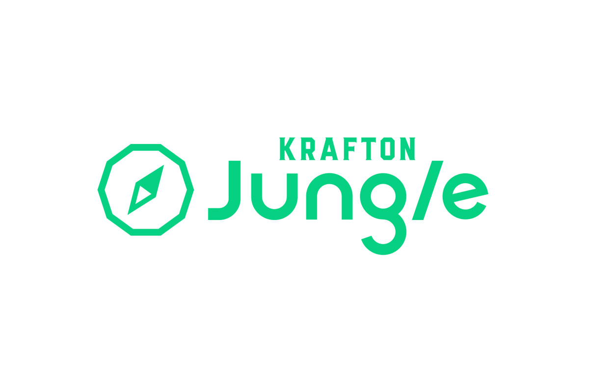
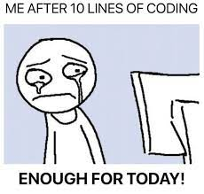
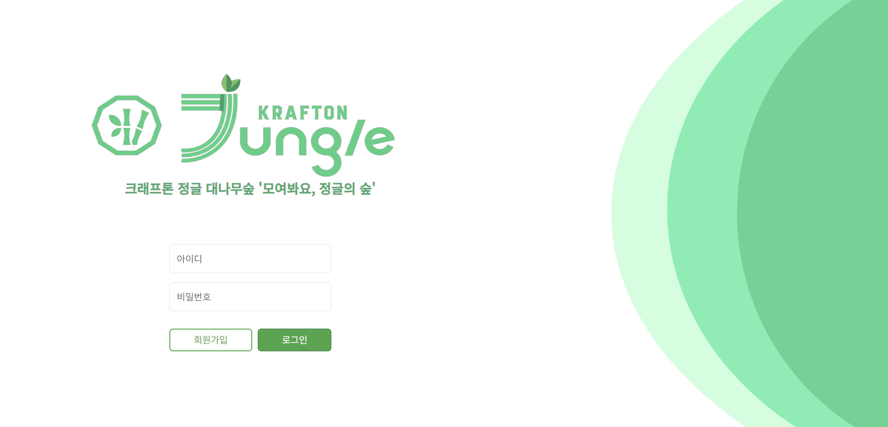
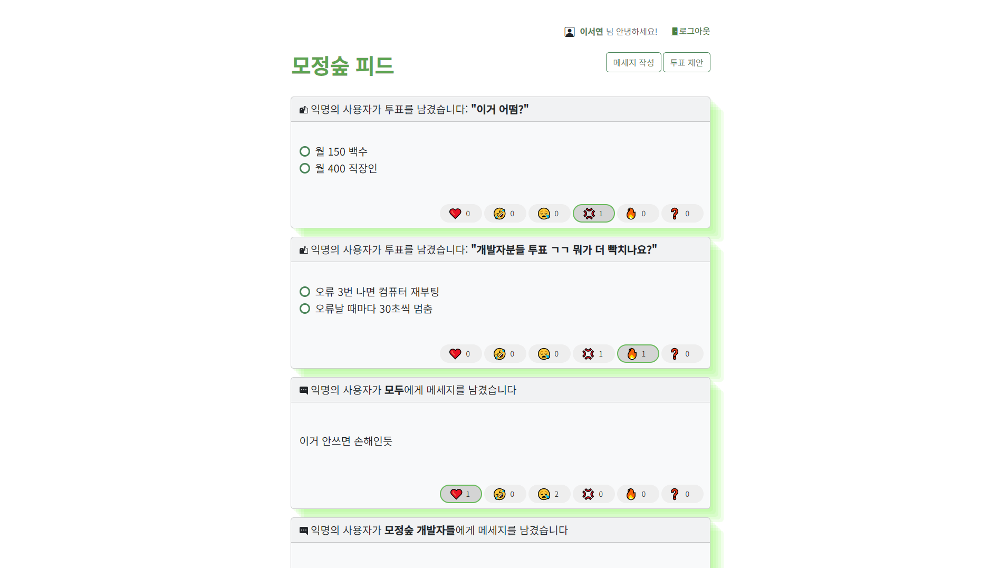
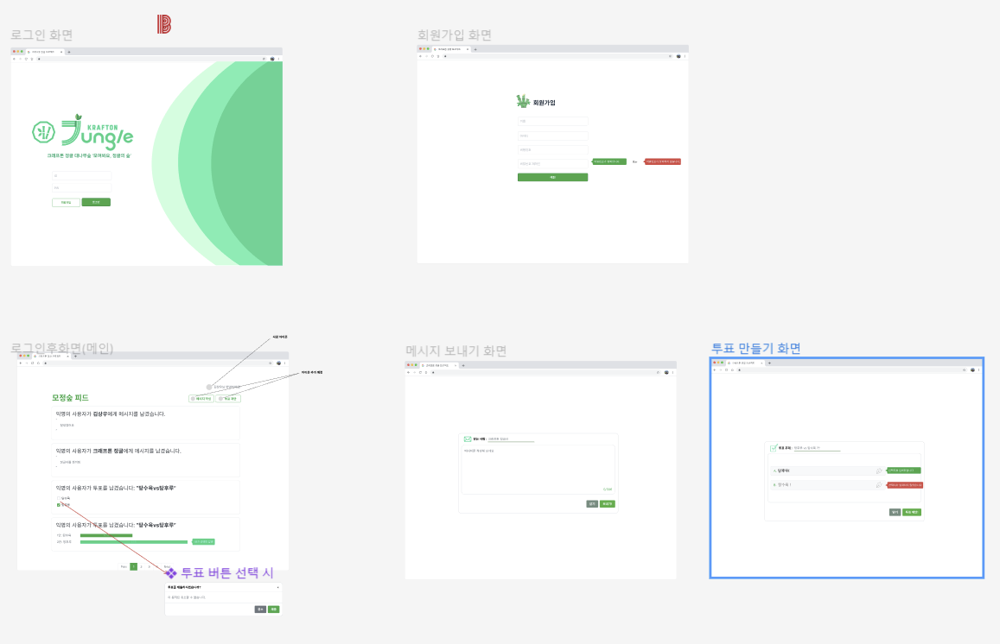
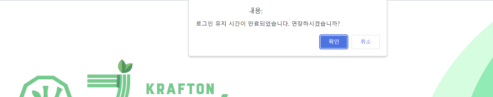
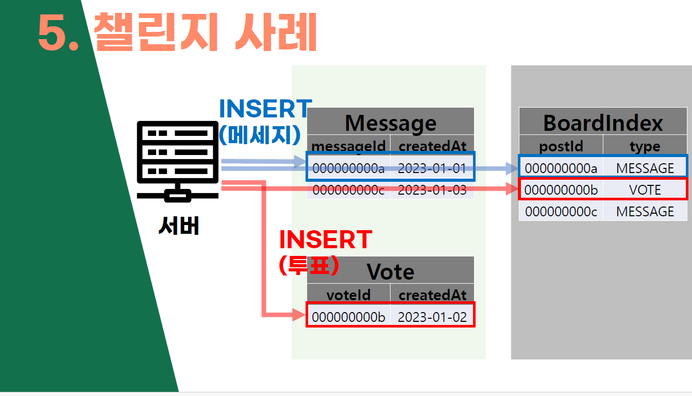
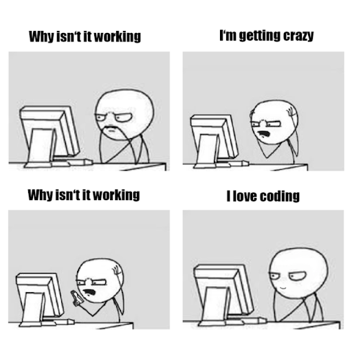

#### **그렇게 되었습니다**

현재 나는, 경기대학교 캠퍼스에서 **크래프톤 정글의 '정글러'**로서 삶을 살고 있다. 집을 벗어나 오래 생활하게 된 것도 처음이고 낯선 사람들과 팀 프로젝트를 하고... 인생은 정말 한치 앞을 모르는구나.

하루하루 정신없고 **밥먹고 코딩하고 공부하고 밥먹고 코딩하고...** 의 연속이다. 그렇게 자고 일어나면 똑같은 하루가 시작된다. 토요일도 예외는 없다. 오전 10시-오후11시의 무시무시한 일과는 계속된다.



10줄을 입력한 후의 나, '이정도면 오늘 할 일 다했다!'

라고 하고 싶지만... 입소하고 난지 5일 째인 오늘, 벌써 깃허브엔 70커밋이 넘었고, 내 앞에 주어진 수많은 코테 문제들이 나를 기다리고 있다... ~(살려주세요)~

사실 평소에는 한 주에 한 번, 몇 문제 풀기/뭐뭐 정리해오기 등을 정해놓으면, 사실 막상 하는데 오래 걸리지 않는데도 잘 하지 않았고 점점 집중하지 못했던 나날들이 많았다. 그치만 적어도 여기에선, 열심히 하는 옆의 동료들과 집중할 수밖에 없는 환경 속에서 정신없이, 열심히 공부하고 있다. 하핫 ...

#### **크래프톤 정글 3기에 지원했던 동기와 마음가짐** 

왜 이런 정글 속에 들어왔냐면...

4학년 막학기를 남기고, 주변 사람들도 다 각자의 길로 흩어지고 '선택의 기로'에 놓였었다.

휴학을 할 지, 안 할지, 또는 부트캠프를 할 지, 혼자 공부할 지, 국비 지원 교육을 들을지...

우선, 포트폴리오 구축이나 프로젝트 경험을 쌓는 것도 좋지만, 아무것도 안 하고 '**코딩테스트 준비**'에만 몰두해도 괜찮다는 생각이 있었다. 그러나, 수많은 시도와 스터디 경험으로 통해 느낀 것은.. 혼자 공부하고 여기에 매달리는게 정말 힘든 일이라는 것이다.

그러다 알게 된 것이, 오프라인 합숙으로 공부할 수 있고, CS 기본 지식과 코딩테스트 준비를 하기에 적합한 프로그램인, 이 **'크래프톤 정글'**이었다. 이런 저런 걱정, 여러가지 밖의 이야기들에선 잠시 멀어져, 눈 딱 감고 편안한 장소를 떠나 공부에만 집중하자. 그리고 아직까지는 이 선택을 후회하지 않는다. 

#### **지난 1주 간 생활 (미니 프로젝트) 그리고 느낀 점**

[크래프톤 정글 숏다큐](https://youtu.be/1IpAC08V7uU?si=MjMFmw-rRwR3leT0) 영상에도 나와있듯이, 정글에서의 들어가자마자의 첫 일정은 **3박 4일 내에 '미니 프로젝트'를 완성하라!** 이다. 교육장에서 노트북 세팅을 하고, 친해질 새도 없이 처음 만난 팀원들과 프로젝트를 만들어야 한다. 

팀원들과 이야기해 본 결과, 정글러들끼리 사용할 수 있는 익명 커뮤니티, 일명 대나무숲을 한 번 만들어보자, 하고 의견이  모였었다. 한 문장으로 소개한 우리 서비스는 이렇다.

#### **"정글러가 소개하는 새로운 소통방식, 모정숲!"** (모여봐요, 정글의 숲)



크게 두 개의 화면으로 되어있는데, 로그인/회원가입 페이지가 첫 화면이다. 회원가입은 모달창을 통해 해결할 수 있고, 로그인을 하면 Main인 모정숲 게시판(피드) 페이지로 이동된다.



게시글의 종류는 크게 2가지 이다.

- 메시지: 원하는 상대에게 메시지를 남긴다.

- 투표: 원하는 주제로 투표 옵션을 만들고, 투표할 수 있다.



사실 피그마를 많이 다뤄보거나 하지는 않았는데, 막상 해야하는 상황에 닥치고보니 쓱쓱 하게 된다는 걸 알았다. 디자인과 유사하게 만드려고 정말 노력했다.

목표한 기능까지 완성을 한 후, 최종 발표까지 마쳤다. 코치님들의 매서운 지적(혹평)은 어느정도 예상하고 있었지만, 끝나고나니 정말 애송이 같은 생각을 하고 있었구나, 하는 생각을 했다. 잠도 못자가면서 열심히 만들었는데, 써보면 이 짧은 시간에 얼마나 내부 구현과 처리를 잘 했고, 인터랙션에 신경쓰고, 직관적으로 보이게 디자인과 사소한 디테일을 맞추었는지 알텐데...



토큰 구현을 통해 1시간이 지나면 로그인 유지 시간 만료, 30일이 지나면 강제 로그아웃하는 기능(..)도 있었다. 아무도 몰랐겠지만, 여기에서라도 자랑하고 싶었다. 기능자체는 대단한 건 아니지만 짧은 시간에, 로그인/비로그인 상황에 대한 유저가 당연하다고 느낄 법한 시나리오(자동 로그인/페이지 이동 제한)를 구현해 두었다는게 내 마음속에만 남아있는 자부심이다. 프론트 페이지 구성에 익숙하지 않은 팀원들의 페이지의 디자인과 버그 모두 다 (상의 하에) 내가 수정하고 갈아엎었다.

수고했다 내자신...

코치님들의 피드백이 다 마친 후에는, 사실 엄청 속상했다.

5분이라는 발표 시간이 우리 서비스에 대한 이해를 시키고, 납득이 가게 서비스를 만들었는지 소개하기에는 너무 짧기는 하지만, **'설득력 있는 서비스'를 만드는 것의 벽이 생각보다 높음**을 실감했다. 특히나 서비스를 평가하는 입장에 가깝고, 현업에 오랜 시간을 보내셨고, 수많은 런칭 서비스를 봐 왔었던 코치님들의 말씀이니, 차가운 현실을 훅 직시한 느낌이었다.

동시에 밖에 나가면 그냥 pass 당하고 지날 것을, 따가운 잔소리로 듣고 고칠 수 있는 기회로 만들어 주셨다는 것은 물론 실감하고 있다. 우리 서비스를 써보면 좋은 걸 알텐데, 라고 생각했지만 **결국 사람들을 설득하지 못하면 그 사람들이 우리 서비스를 써 볼 기회조차 생기지 않는다**. 악플도 사람이 많은 곳에나 있지, 사람들이 없는 곳에는 먼지만 쌓일 뿐이다.

이외의 피드백은 다음과 같았다.

- **SSL(Server Side Rendering)을 잘 활용하였는가? SSL vs CSL 차이를 잘 알고 이를 활용하려고 하였는지?**

필수 구현 사항인 SSL을 위해 Jinja2 템플릿엔진을 사용하였지만, 사실 이를 왜 사용하는지는 궁금해 하지 않았던 것 같다. 가장 중요한 "왜?" 라는 질문 없이 무작정 개발하는 것이 나에게 독이 됨을 누구보다 실감하는데, 어쩔 수 없는 상황이었음에도 조금 마음이 아팠다.

그리고 한 켠에는 [토스 SLASH23 컨퍼런스](https://www.youtube.com/watch?v=Zs3jVelp0L8)에서 들었던 BFF(Backend-for-Frontend) 패턴이 생각났다. 프론트엔드 구성을 위한 데이터나 어쩌면 UI 구성까지도 정의하여 Frontend로 보내준다는 이상적인 패턴이다. [카카오엔터테이먼트 기술블로그](https://fe-developers.kakaoent.com/2022/220310-kakaopage-bff/)를 보면, BFF의 가장 큰 장점은 실제 비즈니스 로직의 구현과 응답 데이터를 클라이언트에서 요구되는 데이터로 파싱하는 두가지 관점을 분리하여 복잡도를 낮추고, 필요한 작업에 집중하기 쉬워지는 것이라고 한다. 

SSL은 다른 개념이기는 하지만, '프론트엔드의 비즈니스 로직을 줄이는 것' 그리고 '프론트엔드 단에서 빌드하는 것을 최대한 줄이는 것'이라는 목표는 유사하다고 생각한다. 

이를 고려했다면, 설계부터 생각하여 SSL을 위한 어플리케이션을 만들 수 있었지 않았을까 생각한다.

- **직관적이지 않다. 디자인적으로도, 기획적으로도 이해가 가지 않는 부분이 있다.**

만드는 팀원들이 생각했을 때는 충분히 납득 가능하고 익숙한 기능과 디자인이라고 생각했는데, 코치분들의 생각은 많이 달랐던 것 같다. 처음에 기획 발표를 들으니 이제 익숙해졌지, 처음 봤으면 전혀 한 눈에 들어오는 디자인과 UX가 아니다. 라고 지적하셨다. 괜찮다고 안주했던 짧은 식견이 드러난 것 같아 부끄러웠다.

- **어려웠던 챌린지 사례를 메인 게시글 조회를 위해 따로 만든 테이블의 이야기를 들었는데, 기술적으로 아쉽고 다른 사례들을 찾아보고 적용했으면 어땠을까**



메인 게시글의 종류가 메시지/투표 로 다른 상태에서, 각각의 구성 요소와 내용이 다른 것을 어떻게 한 번에 가져올지, 에 대한 이슈가 있었는데 회의 결과, 이들의 type을 구분하되 같이 보관하는 테이블을 만들자! 하고 나름의 결론을 내렸었다. 하지만 이것이 역시나 기술적으로 미흡했던 것 같다. 사실 이조차도 transaction 처리가 되지 않아 언제든지 문제가 생길 수 있는 기능이기는 했다. 이 점은 나도 무척이나 아쉽다.

마지막으로 하나 더 느낀 것이 있다면, **어설프게 하면 그게 무조건 티가 난다.** 그리고 이를 무조건 눈치챌 수밖에 없다. 드러낼 것은 과감하게 드러내되 자신있게 보일 수 있을 정도여야 하고, 아니라면 철저히 감추는게 완성도나 여러 측면에서 좋은 것 같다. 

#### **5개월 후의 나**

사실은 잘 모르겠다. 내일의 나도 모르는데 이를 어떻게 생각해 볼 수 있을까.?

다만, 코딩테스트를 푸는 것, CS 지식을 설명하는 것, 그리고 나만의 서비스를 자신있게 이야기하고 설명할 수 있는 내가 되길 바란다. 더불어, 코딩자체만으로도 재미를 붙이고 이 행위를 즐기는 사람이 되고 싶다. 



코딩하는게 늘 즐겁지는 않다. 좋다가도 싫고, 싫다가도 좋은게 이것 같다.(괴롭다) 그래도 계속하면서 정말로 '하고 싶어서 하는 사람'이 되고 싶다. 적어도 현재는 그런 기분은 모르기 때문이다.

어제보다 오늘, 오늘보다 내일 나은 사람이 되자.

```toc

```
