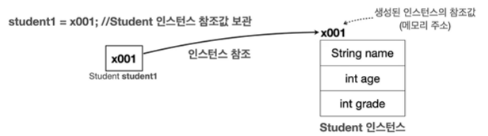
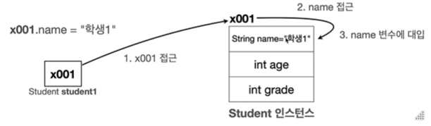
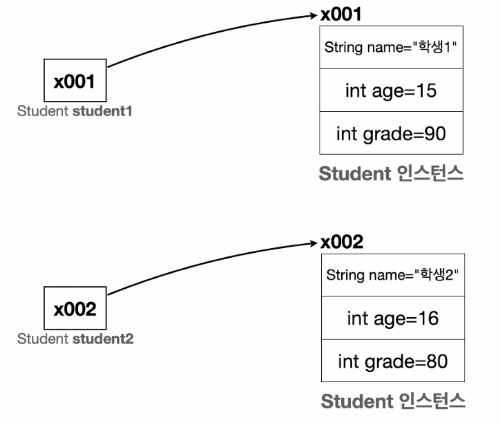
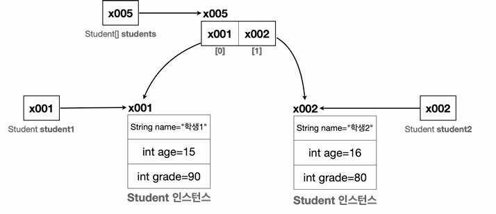
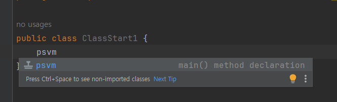
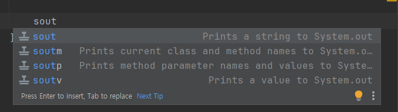
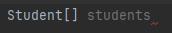
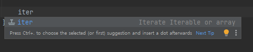

### 1. 클래스가 필요한 이유

학생 정보를 출력하는 코드를 보며 이해해보자.

```java
String student1Name = "학생1";
int student1Age = 15;
int student1Grade = 90;

String student2Name = "학생2";
int student2Age = 16;
int student2Grade = 80;

System.out.println("이름: " + student1Name + " 나이: " + student1Age + " 성적: " + student1Grade);
System.out.println("이름: " + student2Name + " 나이: " + student2Age + " 성적: " + student2Grade);
```

학생 2명을 출력하기 위해 각각 다른 변수를 사용했다. 

→ 문제: 학생이 늘어날 때마다 변수와 출력하는 코드를 추가 선언해야 한다.

✅ **배열을 사용하여 정보를 담자**

```java
String[] studentNames = {"학생1", "학생2"};
int[] studentAges = {15, 16};
int[] studentGrades = {90, 80};

for (int i = 0; i < studentNames.length; i++) {
    System.out.println("이름: " + studentNames[i] + " 나이: " + studentAges[i] + " 성적: " + studentGrades[i]);
}
```

배열에 값을 추가하기만 하면, 학생 정보를 늘릴 수 있고 불필요한 코드를 줄일 수 있게 되었다.

**배열 사용의 한계**

배열을 사용하여 변경을 최소화했지만, 한 학생의 데이터가 여러 배열에 나누어져 있어, 데이터를 변경할 때 매우 조심해서 작업해야 한다. 

즉, 한 학생의 데이터를 바꾸기 위해 3개의 배열을 모두 변경해야 한다는 것이다. 컴퓨터가 처리할 때는 아무 문제가 없겠지만, 사람이 관리하기에 좋은 방식은 아니다.

사람이 관리하기 좋기 위해서는, ‘학생’이라는 개념을 하나로 묶는 것이다. **= 클래스**

### 2. 클래스 사용해보기

```java
public class Student {
    String name;
    int age;
    int grade;
}
```

이렇게 정의한 클래스는 name, age, grade라는 멤버 변수(혹은 필드)를 가진다.

이제 위의 클래스를 사용해보자.

```java
Student student1;           // Student 타입을 받을 수 있는 변수를 선언한다.
student1 = new Student();   // Student 클래스를 기반으로 새로운 객체를 생성한다.
student1.name = "학생1";
student1.age = 15;
student1.grade = 90;

Student student2 = new Student();
student2.name = "학생2";
student2.age = 16;
student2.grade = 80;

System.out.println("이름: " + student1.name + " 나이: " + student1.age + " 성적: " + student1.grade);
System.out.println("이름: " + student2.name + " 나이: " + student2.age + " 성적: " + student2.grade);
```

**클래스와 사용자 정의 타입**

타입은 데이터의 종류나 형태를 나타낸다. (int: 정수 타입, String: 문자 타입)

→ 학생(Student)라는 타입을 만들면 되지 않을까? 클래스를 사용하면 만들 수 있다.

사용자가 직접 정의하는 사용자 정의 타입을 만들려면 설계도가 필요한데, 이것이 **클래스**이다.

설계도인 클래스를 사용해서 실제 메모리에 만들어진 실체를 **객체 또는 인스턴스**라고 한다.

**메모리에서 일어나는 일**



Student 클래스의 객체를 생성하면

- 클래스의 멤버 변수(name, age, grade)를 사용하는데 필요한 메모리 공간도 함께 확보한다.
- (`new` 키워드를 통해 생성하면) 자바는 메모리 어딘가에 있는 이 객체에 접근할 수 있는 참조값(주소) ( x001 )을 반환한다.
- 앞서 선언한 변수 `Student student1` 에 생성된 객체의 참조값을 보관한다.
- 따라서 `Student student1` 변수를 통해서 메모리에 있는 실제 객체를 접근(참조)할 수 있다.

**참조값을 변수에 보관해야 하는 이유**

`new Student();` 코드 자체는 아무런 이름이 없다. 단순히 Student 클래스를 기반으로 메모리에 실제 객체를 만드는 것일 뿐이고, 반환되는 참조값을 어딘가 보관해두어야 객체에 접근할 수 있다. 우리는 `Student student1` 변수에 참조값을 저장해두었으므로 실제 메모리에 존재하는 객체에 접근할 수 있다.

### 3. 객체 접근하기

객체에 접근하려면, `.` (dot)을 사용하면 된다.

```java
student1.name = "학생1";
```

- student1에 들어있는 참조값을 읽어서 메모리에 존재하는 객체에 접근한다.
- 참조값(x001)에서 name 변수에 “학생1” 데이터가 저장된다.



값을 읽는 것도 위와 같은 방식으로, `student1.name` 과 같이 사용하면 된다.

### 4. 클래스, 객체, 인스턴스

**클래스 (Class)**

- 객체를 생성하기 위한 ‘틀’, ‘설계도’
- 객체가 가져야 할 속성(변수)과 기능(메서드)를 정의함

**객체 (Object)**

- 클래스에서 정의한 속성과 기능을 가진 실체. 객체는 서로 독립적인 상태를 가짐

**인스턴스 (Instance)**

- 특정 클래스로부터 생성된 객체. 객체와 인스턴스는 자주 혼용됨
- 주로 객체가 어떤 클래스에 속해 있는지 강조할 때 사용함 (ex. `student1`은 `Student` 클래스의 인스턴스다)

**객체 vs 인스턴스**

- 둘다 클래스에서 나온 실체라는 의미에서 비슷하게 사용됨
- 인스턴스는 객체보다 좀 더 관계에 초점을 맞춘 단어임.
- ‘ `student1`은 `Student` 클래스의 객체임’ 보다는 ‘`student1`은 `Student` 클래스의 인스턴스임’ 라고 주로 말함.
- 모든 인스턴스는 객체이지만, 인스턴스라고 부르는 순간은 특정 클래스로부터 그 객체가 생성되었음을 강조하고 싶을 때이다.

하지만 보통 둘을 구분하지 않고 사용한다.

### 5. 배열을 도입해보자

```java
System.out.println("이름: " + student1.name + " 나이: " + student1.age + " 성적: " + student1.grade);
System.out.println("이름: " + student2.name + " 나이: " + student2.age + " 성적: " + student2.grade);
```

학생을 출력하는 부분이 중복되는 코드가 있었는데, 배열을 사용하면 특정 타입을 연속한 데이터 구조로 묶어서 편하게 관리할 수 있다.



`Student` 배열(size=2)을 선언하면 아래 그림처럼 된다. (`Student` 타입의 참조값을 보관함)

```java
Student[] students = new Student[2];
```


- 배열에는 아직 참조값을 대입하지 않았기 때문에 참조값이 없다는 의미의 `null`로 초기화된다.

그리고 배열에 객체를 보관하는 코드는 이렇다.

```java
students[0] = student1;
students[1] = student2;
```

**Java에서 대입은 항상 변수에 들어있는 값을 복사하는 것**이므로, 참조값이 배열에 저장된다.



**배열에 들어있는 객체 사용하기**

```java
System.out.println("이름: " + students[0].name);
```

- `students[0].name` = `x005[0].name` = `x001.name` 에 접근하는 것과 같음.

**배열 사용하여 코드 중복 줄이기**

```java
// Student[] students = new Student[] {student1, student2};
Student[] students = {student1, student2}; // 위의 코드보다 더 짧게 선언 가능하다.
  
for (int i = 0; i < students.length; i++) {
    System.out.println("이름: " + students[i].name + " 나이: " + students[i].age + " 성적: " + students[i].grade);
}

// 반복요소를 변수에 담아, 중복을 더욱 줄일 수 있다
for (int i = 0; i < students.length; i++) {
            Student s = students[i];
            System.out.println("이름: " + s.name + " 나이: " + s.age + " 성적: " + s.grade);
        }
```

for문으로 배열을 돌며, 출력을 최적화할 수 있다.

**향상된 for문**

```java
for(Student s : students) {
            System.out.println("이름: " + s.name + " 나이: " + s.age + " 성적: " + s.grade);
        }
```

---

### 사용한 IntelliJ단축키

- **“psvm” + Enter**: `public static void main(String[] args)` 자동완성



- **“sout” + Enter**: `System.*out*.println` 자동완성



- **Ctrl + Space**: 변수명 자동 생성



- “iter”: **for each** 문 자동생성
