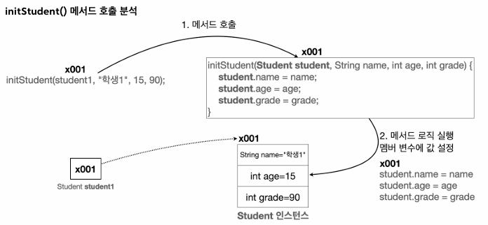
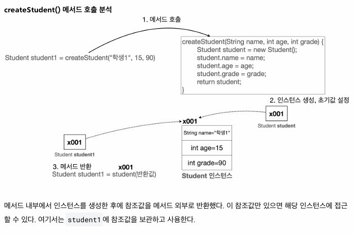
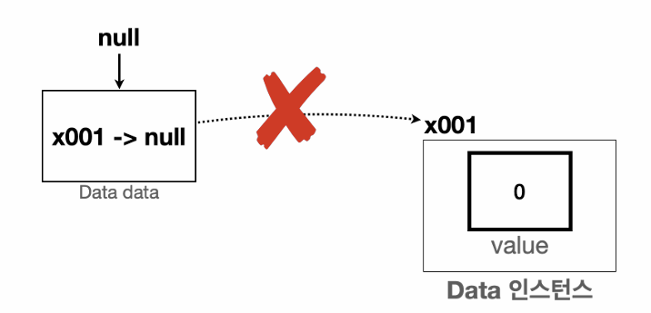
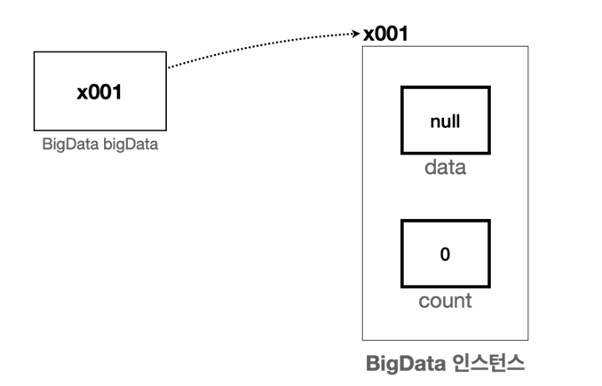

## **1. 기본형 vs 참조형**

변수의 데이터 타입을 크게 보면 기본형과 참조형으로 구분 할 수 있다.

- **기본형(Primitive Type)**:  변수에 사용할 값을 직접 넣을 수 있는 데이터타입
    - ex. `int`, `long`, `double`, `boolean`
- **참조형(Reference Type)**: 데이터에 접근하기 위한 참조(주소)를 저장하는 데이터 타입 (객체 또는 배열에 사용된다.)
    - ex. `Student student1`

### 기본형 vs 참조형

- 기본형 변수
    - 직접 사용할 수 있는 값이 들어있다, 해당 값을 바로 사용 가능. (ex. `10`, `20`)
    - 연산이 가능하다
        
        ```java
        int a = 10, b = 20;
        int sum = a + b;
        ```
        
    - Java가 기본으로 제공하는 데이터 타입이다. (개발자가 직접 정의할 수 없음)
- 참조형 변수
    - 위치(참조값)이 들어가 있다.
        
        참조형 변수를 통해서 뭔가를 하려면 참조값을 통해 해당 위치로 이동해야 한다.
        
        - 객체는 `.` (dot)을 통해 메모리 상에 생성된 객체를 찾아가야 사용 가능
        - 배열은 `[]` 를 통해 메모리 상에 생성된 배열을 찾아가야 사용 가능
    - 들어있는 참조값만으로는 연산을 할 수 없다.
        
        ```java
        Student s1 = new Student();
        Student s2 = new Student();
        
        s1 + s2 // 오류 발생
        ```
        
        물론 `.` 을 통해 멤버변수에 접근 가능한 경우 연산은 가능하다.(ex. `s1.grade + s2.grade` )
        
		<br/>

    - TIP: 클래스는 모두 참조형이고, 클래스는 대문자로 시작한다.
        
        *참고: String 또한 클래스고 참조형이다. 그런데 기본형처럼 문자 값을 바로 대입할 수 있다.
        

---


## **2. 기본형 vs 참조형 - 변수 대입 면에서**

**🚨 대원칙: Java는 항상 변수의 값을 복사해서 대입한다.🚨**

- 기본형이면 변수에 들어있는 실제 사용하는 값을 복사해서 대입한다.
    
    ```java
    int a = 10;  // 10이라는 값을 복사해서 대입한다
    ```
    
- 참조형이면 변수에 들어 있는 참조값을 복사해서 대입한다.
    
    ```java
    Student s1 = new Student();  // x001 과 같은 참조값을 복사해서 대입한다
    ```
    
    실제 사용하는 객체가 아니라, 객체의 위치를 가르키는 참조값만 복사되는 것에 유의한다.
    

### 기본형 변수 값을 변경하는 예시

```java
 int a = 10;
 int b = a;
 System.out.println("a = " + a);
 System.out.println("b = " + b);
 
 //a 변경
 a = 20;
 System.out.println("변경 a = 20");
 System.out.println("a = " + a);     // 20
 System.out.println("b = " + b);     // 10
```

변수의 값을 복사해서 대입하는 것이므로, `b`는 `a`에 있는 값 10을 복사해서 `b`에 대입했고, 이후 `a`에 값 20을 복사해서 대입하였으니, 결과적으로 `a`=20, `b`=10이 된다.


### 참조형 변수 값을 변경하는 예시

```java
 Data dataA = new Data();
 dataA.value = 10;
 Data dataB = dataA;
 
 System.out.println("dataA 참조값=" + dataA);
 System.out.println("dataB 참조값=" + dataB);
 System.out.println("dataA.value = " + dataA.value);   // x001
 System.out.println("dataB.value = " + dataB.value);   // x001
 
 //dataA 변경
 dataA.value = 20;
 System.out.println("변경 dataA.value = 20");
 System.out.println("dataA.value = " + dataA.value);   // 10
 System.out.println("dataB.value = " + dataB.value);   // 10
 
 //dataB 변경
 dataB.value = 30;
 System.out.println("변경 dataB.value = 30");
 System.out.println("dataA.value = " + dataA.value);   // 20
 System.out.println("dataB.value = " + dataB.value);   // 20
```

- `Data dataA = new Data();` : `Data` 객체의 참조값 x001을 반환
- `Data dataB = dataA;` : `dataA`의 참조값 x001을 복사해서 대입
- dataA.value = 20; : `dataA`의 참조값 x001 의 value를 20으로 변경
- 따라서 dataA.value로 접근, 변경하든 `dataB.value`로 접근, 변경하든 똑같은 참조값을 가지고 있어 같은 값을 출력하게 된다.

---

## **3. 기본형 vs 참조형 - 메서드 호출**

메서드를 호출할 때 사용하는 매개변수(파라미터)도 결국 변수이기 때문에, 메서드를 호출할 때 매개변수에 값을 전달하는 것도 값을 복사해서 전달한다.

### 기본형 타입의 매개변수 변경하기

```java
public class MethodChange1 {
 public static void main(String[] args) {
			 int a = 10;
			 System.out.println("메서드 호출 전: a = " + a);   // 10
			 changePrimitive(a);
			 System.out.println("메서드 호출 후: a = " + a);   // 10
    }
 static void changePrimitive(int x) {
        x = 20;
    }
 }
```

메서드를 호출할 때, 매개변수 `x`에 변수 `a`의 값을 전달한다. 즉, `a`의 값을 복사해서 대입한다.

메서드 안에서 값 20으로 대입한다. 결과적으로 `x`의 값만 20으로 변경되고 `a`의 값은 10으로 유지된다.

### 참조형 타입의 매개변수 변경하기

```java
 public class MethodChange2 {
	 public static void main(String[] args) {
		 Data dataA = new Data();
		 dataA.value = 10;
		 
		 System.out.println("메서드 호출 전: dataA.value = " + dataA.value);    // 10
		 changeReference(dataA);
		 System.out.println("메서드 호출 후: dataA.value = " + dataA.value);    // 20
	 }
	 
	 static void changeReference(Data dataX) {
        dataX.value = 20;
    }
 }
```

메서드를 호출할 때, 매개변수 `dataX`에서 변수 `dataA`의 참조값 x001을 복사해서 전달한다. 그러므로, `dataX`를 통해서 x001에 있는 Data 인스턴스에 접근할 수 있다.

그래서 메서드 안에서 x001 인스턴스에 접근하여 값을 20으로 변경하므로, `dataA.value` 또한 20으로 변경된다. 


### 기본형과 참조형의 메서드 호출

- **기본형**: 메서드로 기본형 데이터를 전달하면, 해당 값이 복사되어 전달된다.
    
    메서드 내부에서 매개변수(파라미터)의 값을 변경해도, 호출자의 변수 값에는 영향이 없다.
    
- **참조형**: 메서드로 참조형 데이터를 전달하면, 참조값이 복사되어 전달된다. 이
    
    메서드 내부에서 매개변수(파라미터)로 전달된 객체의 멤버 변수를 변경하면, 호출자의 객체도 변경된다.
    
---

## **4. 참조형과 메서드 호출 - 활용**

### 메서드에 객체 전달하기

아래의 코드에는 중복되는 부분이 2가지 있다.

- name, age, grade에 값을 할당
- 학생 정보를 출력

```java
 public class ClassStart3 {
 public static void main(String[] args) {
	  Student student1;
	  student1 = new Student();
	  student1.name = "학생1";
	  student1.age = 15;
	  student1.grade = 90;
	  
	  Student student2 = new Student();
	  student2.name = "학생2";
	  student2.age = 16;
	  student2.grade = 80;
	
	 System.out.println("이름:" + student1.name + " 나이:" + student1.age + " 성적:" + student1.grade);
	 System.out.println("이름:" + student2.name + " 나이:" + student2.age + " 성적:" + student2.grade);
    }
 }

```


참조형 타입 매개변수를 사용하여 메소드 안에서 참조값을 통해 객체에 접근하여 값을 변경할 수 있어, 코드의 중복을 줄일 수 있다.

```java
public static void main(String[] args) {
		 Student student1 = new Student();
		 initStudent(student1, "학생1", 15, 90);
		 
		 Student student2 = new Student();
		 initStudent(student2, "학생2", 16, 80);
		 
		 printStudent(student1);
		 printStudent(student2);
}

static void initStudent(Student student, String name, int age, int grade) {
    student.name = name;
    student.age = age;
    student.grade = grade;
}

static void printStudent(Student student1) {
	System.out.println("이름:" + student1.name + " 나이:" + student1.age + " 성
적:" + student1.grade);
}
```



### 메서드에서 객체 반환하기

- 변경한 코드에서도 중복이 있다. (객체를 생성하고 초기값을 설정하는 부분)

```java
Student student1 = new Student();
initStudent(student1, "학생1", 15, 90);

Student student2 = new Student();
initStudent(student2, "학생2", 16, 80);
```

```java
public static void main(String[] args) {
		Student student1 = createStudent("학생1", 15, 90);
		Student student2 = createStudent("학생2", 16, 80);
		printStudent(student1);
		printStudent(student2);
}

static Student createStudent(String name, int age, int grade) {
	Student student = new Student();
	student.name = name;
	student.age = age;
	student.grade = grade;
	return student;
}

 // ...
```

메서드 안에서 객체를 생성하는 부분까지 포함하고, 생성한 객체의 참조값을 return할 수 있다.



---

## **5. 변수와 초기화**

### 변수의 종류

- **멤버 변수**: 클래스에 선언
    
    ```java
    public class Student {
    	 String name;
    	 int age;
    	 int grade;
    }
    ```
    
- **지역 변수**: 메서드에 선언, 매개변수도 지역 변수의 한 종류
    
    이름 그대로 특정 지역에서만 사용되는 변수.(메서드의 블록 안에서만 등…)
    
    ```java
    public class MethodChange1 {
    	 public static void main(String[] args) {
    		 int a = 10;
    		 System.out.println("메서드 호출 전: a = " + a);
    		 changePrimitive(a);
    		 System.out.println("메서드 호출 후: a = " + a);
    	}
     
    	public static void changePrimitive(int x) {
    	    x = 20;
    	}
    }
    ```
    


### 변수의 값 초기화

- 멤버변수: 자동 초기화
    - `int`는 0, `boolean`은 false, 참조형은 null
    - 개발자가 직접 세팅할 수도 있음
- 지역변수: 수동 초기화
    - 항상 직접 초기화해야 한다.


### 멤버변수의 초기화

```java
public class InitData {
	int value1;        //초기화 하지 않음
	int value2 = 10;   //10으로 초기화
}

public class InitMain {
	 public static void main(String[] args) {
		 InitData data = new InitData();
		 System.out.println("value1 = " + data.value1);   // 0
		 System.out.println("value2 = " + data.value2);   // 10
   }
 }
```

초기화되지 않은 멤버 변수는 0으로 출력되는 것을 볼 수 있다.


---

## **6. null**

참조형 변수에서 아직 가르키는 대상이 없다면 null이라는 값을 넣어둘 수 있다. 존재하지 않는다는 뜻이다.

```java
public class Data {
 int value;
 }
 
  public class NullMain1 {
		 public static void main(String[] args) {
		 Data data = null;
		 System.out.println("1. data = " + data);  // null
		 data = new Data();
		 System.out.println("2. data = " + data);  // x001
		 Data data = null;
		 System.out.println("3. data = " + data);  // null
		 }
 }
```

참조값을 가지고 있던 변수에 null을 할당하면, 더이상 이전의 인스턴스를 참조하지 않는다.


### GC(Garbage Collection) 
**아무도 참조하지 않는 인스턴스의 최후**

data에 null을 할당하면, 앞서 생성한 인스턴스를 더는 아무도 참조하지 않는다. 이렇게 아무도 참조하지 않는 인스턴스는 사용되지 않고 메모리 용량만 차지한다.

C와 같은 과거 프로그래밍 언어는 개발자가 직접 메모리에서 제거해야 했지만, Java는 이런 과정을 자동으로 처리해준다. 아무도 참조하지 않는 인스턴스가 있으면 JVM의 GC(가비지 컬렉션)가 더이상 사용하지 않는 인스턴스라 판단하고 해당 인스턴스를 자동으로 메모리에서 제거해준다.

---


## **7. NullPointerException**

참조값이 없는 것(null을 가르키는  것)을 찾아갈 때 발생하는 예외이다. null에 `.` (dot)을 찍었을 때 발생한다.

`null.value` 과 같이 사용하면 참조할 주소가 존재하지 않으므로, `java.lang.NullPointerException` 이 발생하고 프로그램이 종료된다. 예외가 발생한 다음 로직은 수행되지 않는다.


### 멤버 변수와 null

지역 변수의 경우에는 null 문제를 파악하는 것이 어렵지 않으나, 멤버 변수가 null인 경우 주의가 필요하다.

```java
public class Data {
	 int value;
}
 
public class BigData {
	 Data data;
	 int count;
}

public class NullMain3 {
  public static void main(String[] args) {
		 BigData bigData = new BigData();
		 System.out.println("bigData.count=" + bigData.count);
		 System.out.println("bigData.data=" + bigData.data); 
		 
		 System.out.println("bigData.data.value=" + bigData.data.value); //NullPointerException 발생
  }
}
```

bigData의 멤버변수 data가 null이므로 이를 참조하면 에러가 생긴다.



`BigData bigData = new BigData();` 다음에 `bigData.data = new Data()`; 해주면 에러가 해결된다.

```toc

```