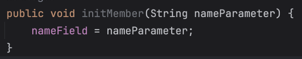
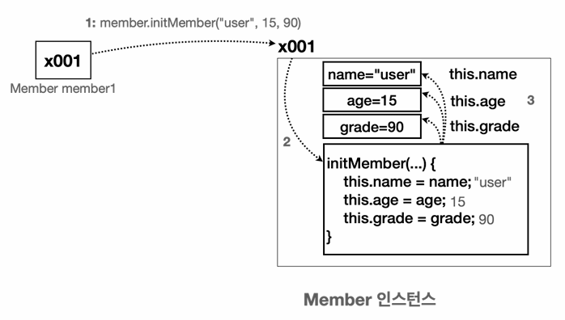

### 1. 생성자가 필요한 이유

객체를 생성하는 시점에서 생성자(Constructor)를 사용하면 된다. 

코드로 생성자가 왜 필요한지 알아보자.

```java
public class MemberInit {
	 String name;
	 int age;
	 int grade;
}
```

```java
public class MethodInitMain2 {
  MemberInit member1 = new MemberInit();
	member1.name = "user1";
	member1.age = 15;
	member1.grade = 90;
	
	MemberInit member2 = new MemberInit();
	member2.name = "user2";
	member2.age = 16;
	member2.grade = 80;
	
   MemberInit[] members = {member1, member2};
   for (MemberInit s : members) {
		 System.out.println("이름:" + s.name + " 나이:" + s.age + " 성적:" + s.grade);
   }
}

static void initMember(MemberInit member, String name, int age, int grade) {
    member.name = name;
    member.age = age;
    member.grade = grade;
}
```

위의 코드에서는, 속성과 기능을 한 곳에 두는 것이 더 나은 방법이다. 쉽게 말해 `MemberInit` 이 자기자신이 데이터를 변경하는 기능을 제공하는 것이 좋다.

### 2. this

```java
public class MemberInit {
	 String name;
	 int age;
	 int grade;

	void initMember(String name, int age, int grade) {
		 this.name = name;
		 this.age = age;
		 this.grade = grade;
	}
}
```

위의 작성한 메서드를 보면, 멤버변수의 이름과 매개변수의 이름이 똑같다. **이 둘을 어떻게 구분해야 할까?**

- 이 경우 멤버 변수보다 매개변수가 코드 블럭의 더 안쪽에 있기 때문에 매개변수가 우선순위를 가진다.
- 멤버 변수에 접근하려면 앞에 `this.` 라고 해주면 된다. 이때 `this`는 인스턴스 자신의 참조값.


**this를 생략하고 싶다면?**

```java
void initMember(String nameParameter) {
	nameField = nameParameter;
}
```

매개변수와 멤버변수가 이름이 다르면 `this`를 생략할 수 있다.

- 변수를 찾을 때는 지역변수(매개변수 포함)를 먼저 찾고, 그다음으로 멤버 변수를 찾는다.

아래와 같이 호출해 사용하면 된다.

```java
 
public class MethodInitMain3 {
	 public static void main(String[] args) {
		 MemberInit member1 = new MemberInit();
		 member1.initMember("user1", 15, 90);
		 
		 MemberInit member2 = new MemberInit();
		 member2.initMember("user2", 16, 80);
		 
			MemberInit[] members = {member1, member2};
		  for (MemberInit s : members) {
				 System.out.println("이름:" + s.name + " 나이:" + s.age + " 성적:" + s.grade);
		  }
	 }
}
```

**this와 코딩 스타일**

멤버 변수에 접근할 때 항상 this를 사용하는 코딩 스타일도 있다.

```java
void initMember(String nameParameter) {
	 this.nameField = nameParameter;
}
```

위의 경우에는 this를 생략해도 되지만, 이렇게 this를 사용하면 이 코드가 멤버 변수를 사용한다는 것을 눈으로 쉽게 사용할 수 있다. 

하지만 최근 IDE가 발전하면서 IDE가 멤버변수와 지역변수를 색상으로 구분해준다. 



이런 점 때문에 꼭 필요한 경우에만 사용해도 충분하다고 한다.

### 3. 생성자를 사용해보자

프로그래밍을 하다보면 객체를 생성하고 이후에 바로 초기값을 할당해야 하는 경우가 많다.

그래서 대부분 객체 지향 언어는 객체를 생성하자마자 필요한 기능을 더 편리하게 수행할 수 있도록 생성자라는 기능을 제공한다.

```java
public class MemberConstruct {
	 String name;
	 int age;
	 int grade;

	 MemberConstruct(String name, int age, int grade) {
		 System.out.println("생성자 호출 name=" + name + ",age=" + age + ",grade=" + grade);
		 this.name = name;
		 this.age = age;
		 this.grade = grade;
	 }
 }
```

**생성자와 메서드의 차이점**

- 생성자의 이름은 클래스 이름과 같아야 한다. 따라서 첫 글자도 대문자로 시작한다.
- 생성자는 반환 타입이 없다. 비워두어야 한다.
- 나머지는 메서드와 같다.

**생성자 호출**

생성자는 인스턴스를 생성하고 나서 즉시 호출된다. 생성자를 호출하는 방법은 다음 코드와 같이 생성자 이름과 매개변수에 맞추어 인수를 전달하면 된다.

```java
new MemberConstruct(”user1”, 15, 90);
```

**생성자 사용의 장점**

- 중복 호출의 제거
    
    생성 직후에 필요한 작업을 한번에 처리할 수 있다
    
- 제약-생성자 호출 필수
    
    생성자 등장 이전은, 초기화 메서드를 실수로 호출하지 않아도 프로그램은 작동한다. 하지만 데이터가 없는 상태로 프로그램이 동작하게 되는 문제가 생긴다. 
    
    생성자의 진짜 장점은 **객체를 생성할 때 직접 정의한 생성자가 있다면 직접 정의한 생성자를 반드시 호출해야 된다**는 점이다. (생성자를 여러 개 정의하면 이 중 하나만 호출하면 된다)
    

```java
 MemberConstruct member3 = new MemberConstruct(); //컴파일 오류 발생
```

컴파일 오류는 IDE에서 즉시 확인할 수 있는 좋은 오류이다. 이 경우 개발자는 객체를 생성할 때, 직접 정의한 생성자를 필수로 호출해야 한다는 것을 바로 알 수 있다.

= **생성자를 사용하면 필수 값 입력을 보장할 수 있다**

> 좋은 프로그램은 무한한 자유도가 주어지는 프로그램이 아니라, 적절한 제약이 있는 프로그램이다.
> 

### 4. 기본 생성자

생성자를 만들지 않아도, 생성자는 기본으로 만들어져 호출된다.

```java
public class MemberDefault {
   String name;
   
   //기본 생성자
	 public MemberDefault() {
		}
}
 
public static void main(String[] args) {
	 MemberDefault memberDefault = new MemberDefault();
}
```

- 매개변수가 없는 생성자를 기본 생성자라 한다.
- 클래스에 생성자가 하나도 없으면 자바 컴파일러는 매개변수가 없고, 작동하는 코드가 없는 기본생성자를 자동으로 만들어준다.
- 생성자가 하나라도 있으면 자바는 기본 생성자를 만들지 않는다.

**기본 생성자를 왜 자동으로 만들어줄까?**

생성자 기능이 필요하지 않은 경우에도 모든 클래스에 개발자가 직접 기본 생성자를 정의해야 한다. 생성자 기능을 사용하지 않는 경우도 많기 때문에 이런 편의 기능을 제공한다.

**정리**

- 생성자는 반드시 호출되어야 한다.
- 생성자가 없으면 기본 생성자가 제공된다.
- 생성자가 하나라도 있으면 기본 생성자가 제공되지 않는다.

### 5. 생성자 - 오버로딩과 this

생성자도 메서드 오버로딩처럼 매개변수만 다르게 해서 여러 생성자를 제공할 수 있다.

```java
 public class MemberConstruct {
	 String name;
	 int age;
	 int grade;

	MemberConstruct(String name, int age) {
		 this.name = name;
		 this.age = age;
		 this.grade = 50;
	}
}

 MemberConstruct(String name, int age, int grade) {
	 System.out.println("생성자 호출 name=" + name + ",age=" + age + ",grade=" + grade);
	 this.name = name;
	 this.age = age;
	 this.grade = grade;
 }
}
```

기존 MemberConstrunct에 생성자를 추가하여, 생성자가 2개가 되었다. 추가한 생성자는 grade를 받지 않지만, grade=50으로 초기화 한다.

생성자를 오버로딩 한 덕분에 성적 입력이 꼭 필요한 경우에는 grade가 없는 생성자를 호출하면 된다.

```java
MemberConstruct member1 = new MemberConstruct("user1", 15, 90);
MemberConstruct member2 = new MemberConstruct("user2", 16);
```

**this() 사용하기**

두 생성자를 보면 코드가 중복되는 부분도 있다.

이때 this() 라는 기능을 사용하면 생성자 내부에서 자신의 생성자를 호출할 수 있다. this는 인스턴스 자신의 참조값을 가르킨다. (= 생성자를 호출함)

첫번째 생성자 내부에서 두번째 생성자를 호출하는 예시다.

```java
public class MemberConstruct {
	 String name;
	 int age;
	 int grade;
	 MemberConstruct(String name, int age) {
		 this(name, age, 50); //변경
	 }

	MemberConstruct(String name, int age, int grade) {
		 System.out.println("생성자 호출 name=" + name + ",age=" + age + ",grade=" + grade);
		 this.name = name;
		 this.age = age;
		 this.grade = grade;
	 }
 }
```

**this() 규칙**

- this() 는 생성자 코드의 첫 줄에만 작성할 수 있다.

```java
 public MemberConstruct(String name, int age) { 
	 System.out.println("go");
	 this(name, age, 50);     // 컴파일 오류 발생
}
```