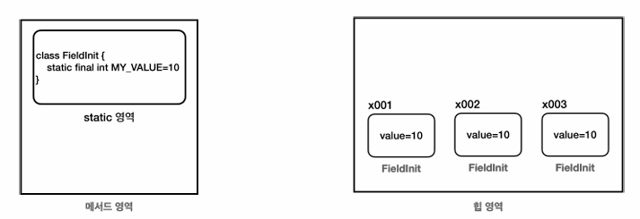

## 1. final 변수

끝! 이라는 뜻으로, 변수에 `final`이 붙으면 더는 값을 변경할 수 없다.

- 참고: `final` 은 class, method를 포함한 여러 곳에 붙을 수 있다.

### 지역변수로 사용하기

```java
final int data1;
data1 = 10;   //최초 한번만 할당 가능
//data1 = 20;   //컴파일 오류
```

- 지역변수에 `final` 을 설정한 경우, 최초 한번만 할당할 수 있고 이후 값을 변경하려면 컴파일 오류가 생긴다

```java
//final 매개변수로 사용해도 변경할 수 없음
static void method(final int parameter) {
   //parameter = 20; 컴파일 오류
}
```

- 매개변수에 `final` 이 붙으면 메서드 내부에서 값을 변경할 수 없다.

### 멤버변수로 사용하기

```java
public class ConstructInit {
		final int value;
		
		public ConstructInit(int value) {
				this.value = value;
		}
 }
```

```java
public class FieldInit {
		static final int CONST_VALUE = 10;
		final int value = 10;
}
```

- `final` 을 필드에 사용할 경우 생성자를 통해 한번만 초기화 될 수 있다. (생성자 초기화)
- 이미 필드에서 초기화를 해 버리면, 생성자를 통해서도 초기화할 수 없다. (필드 초기화)
- `static final` 도 선언할 수 있다. (관례에 따라 대문자 작명)

```java
public class FinalFieldMain {
public static void main(String[] args) {
        //final 필드 - 생성자 초기화
        System.out.println("생성자 초기화");
        ConstructInit constructInit1 = new ConstructInit(10);
        ConstructInit constructInit2 = new ConstructInit(20);
        System.out.println(constructInit1.value);
        System.out.println(constructInit2.value);
        
        //final 필드 - 필드 초기화
        System.out.println("필드 초기화");
        FieldInit fieldInit1 = new FieldInit();
        FieldInit fieldInit2 = new FieldInit();
        FieldInit fieldInit3 = new FieldInit();
        System.out.println(fieldInit1.value);
        System.out.println(fieldInit2.value);
        System.out.println(fieldInit3.value);
        
        //상수
        System.out.println("상수");
        System.out.println(FieldInit.CONST_VALUE);
    }
 }
```

- `ConstructInit` 과 같이 생성자를 사용해서 `final` 필드를 초기화하면, 각 인스턴스마다 `final` 필드에 다른 값을 할당할 수 있다.



- `FieldInit` 과 같이 필드 초기화를 하는 경우, 모든 인스턴스가 오른쪽 그림과 같이 같은 값을 가짐에도 인스턴스마다 메모리를 차지하고 있기 때문에, 결과적으로 메모리를 낭비하게 된다.
    
    이때 사용하면 좋은 것이 `static` 영역이다.
    

### **static final**

- `static final int CONST_VALUE = 10;` 이렇게 사용하면 static 영역에 존재하게 되므로, 공용 변수인데 바뀌지 않는 변수가 된다.
    - `static` 영역은 단 하나만 존재하는 영역이라, 해당 변수는 JVM 상에서 하나만 존재하게 된다.

## 2. 상수

상수는 변하지 않고 항상 일정한 값을 갖는 수를 이야기한다. 자바에서는 보통 단 하나만 존재하는 변치 않는 고정된 값을 상수라고 한다.

### 자바 상수 특징

- `static final` 키워드 사용
    - 대문자 사용, 구분은 `_`(언더스코어) - 관례
- 필드에 직접 접근하여 사용
    - 고정된 값 자체를 사용하는 것이 목적
    - 값을 바꾸는 것이 불가하므로 직접 접근해도 데이터가 변하는 문제가 발생하지 않음
    

`public static final double PI = 3.14;` 

`public static final int HOURS_IN_DAY = 24;`

`public static final int MAX_USERS = 1000;`

- 이런 상수들은 애플리케이션 전반에서 사용되기 때문에 `public`을 자주 사용한다.
- 중앙에서 값을 하나로 관리할 수 있다는 장점이 있다.
- 런타임에 변경 불가능하다.

### 상수가 필요한 이유

```java
public class ConstantMain1 {
		 public static void main(String[] args) {
				 System.out.println("프로그램 최대 참여자 수 " + 1000);
				 int currentUserCount = 999;
				 process(currentUserCount++);
				 process(currentUserCount++);
				 process(currentUserCount++);
			}
				 
		 private static void process(int currentUserCount) {
				 System.out.println("참여자 수:" + currentUserCount);
				 
				 if (currentUserCount > 1000) {
						 System.out.println("대기자로 등록합니다.");
				 } 
				 else {
						 System.out.println("게임에 참가합니다.");
				 }
		}
 }
```

이 코드에는 문제가 있다.

- 프로그램 참여자 수를 변경하고 싶다면, 2곳의 변경 포인트가 발생한다.
    
    이 변경 포인트가 100개였으면 100 곳을 모두 변경해야 한다.
    
- 매직 넘버문제: 1000이 무슨 값인지 보고 이해하기 어렵다.

`Constant.MAX_USERS` 상수를 사용하면, 위의 문제를 해결할 수 있다.

- 값 변경을 원하면 상수 값만 변경하면 된다
- 변수명을 통해 어떤 값인지 이해할 수 있다.

## 3. final 변수와 참조

`final` 은 변수의 값을 변경하지 못하게 막는다. 여기서 ‘변수의 값’은 뭘까?

- 변수는 크게 기본형 변수와 참조형 변수가 있다
- `final` 을 기본형 변수에 사용하면 값을 변경할 수 없다
- `final` 을 참조형 변수에 사용하면 참조값을 변경할 수 없다.

```java
package final1;
public class Data {
		public int value;
}
```

```java
package final1;

public class FinalRefMain {

		public static void main(String[] args) {
				final Data data = new Data();
				//data = new Data(); //final 변경 불가 컴파일 오류
				
				//참조 대상의 값은 변경 가능
				data.value = 10;
				System.out.println(data.value);
				data.value = 20;
				System.out.println(data.value);
		}
}
```

- `data = new Data();`: 참조형 변수 `data` 에 final이 붙었고, 변수 선언 시점에 참조값을 할당했으므로 더는 참조값을 변경할 수 없다.
- `data.value = 10;` : `Data.value` 은 final이 아니므로 값을 변경할 수 있다. (객체 참조값을 바꾸는 것이 아니라 값만 바꾸는 것)

### 4. 정리

`final` 은 특정 변수의 값을 할당한 이후 변경하지 않아야 한다면 `final`을 사용하자.

ex. 고객의 `id`를 변경하면 문제가 생기는 경우, `final`로 선언하고 생성자로 값을 할당함.

```toc

```